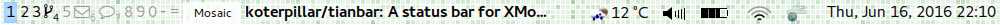

Tianbar
=======

Tianbar is a status bar for XMonad and possibly similar window managers. It is
using WebKit as its rendering engine, meaning that the entire look and feel is
customizable using HTML, CSS and JavaScript.

 

Usage
-----

Tianbar will show `index.html` from its [XDG configuration directory][xdg]
(usually `$HOME/.config/taffybar`). It it up to you to create that, add styles,
widgets and other behavior.

Widgets
-------

A small collection of widgets written in JavaScript is bundled with Tianbar,
see `scripts` directory. To include them on your page, use
`tianbar:///data/` prefix, e.g. `tianbar:///data/scripts/time.js`.

Most widgets require third-party libraries such as [jQuery][jquery] and
[RequireJS][requirejs], and neither of those is distributed with Tianbar --
see individual widget documentation and obtain the libraries manually.

### Power

Displays the battery status for all the batteries reporting through UPower.

### Time

Displays the time and date.

### Volume

Displays the current PulseAudio volume. Note that `module-cli-protocol-unix`
is required to be loaded.

### Weather

Displays the weather at current location (determined via HTML geolocation API)
through [OpenWeatherMap][openweathermap].

### XMonad

XMonad status widget works by listening on DBus for messages sent by the
provided `logHook`, see `System.Tianbar.XMonadLog` documentation for details.

Quirks
------

* AJAX requests from Tianbar are not subject to the same origin policy. This
  makes it easier to interact with various Web services. You can also make
  requests to the local files, for example, to extract CPU activity statistics
  from `/proc/stat`.
* Interaction with the displayed Web page is limited. For example, text fields
  are not active if there are other windows on the screen.

Acknowledgements
----------------

The project is essentially a fork of [Taffybar][taffybar], stripped down of
Haskell configuration and widgets and not yet having achieved functional parity
with it.

[freegeoip]: http://freegeoip.net/
[jquery]: http://jquery.com/
[openweathermap]: http://openweathermap.org/
[requirejs]: http://requirejs.org/
[taffybar]: https://github.com/travitch/taffybar
[xdg]: http://standards.freedesktop.org/basedir-spec/basedir-spec-latest.html
